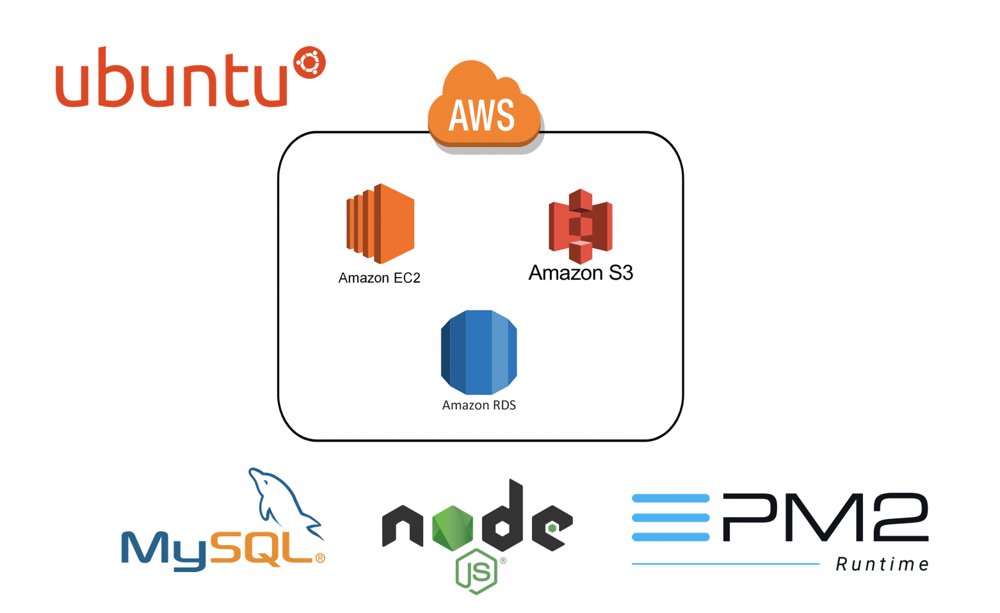

# 정치가 나의 미래다

* 대학생 연합 IT 벤처 창업 동아리 SOPT에서 주최한 해커톤 AppJam에서 진행한 프로젝트입니다.

---

# 주요 기능

* 소셜 로그인 (Kakao, Facebook)

* 국회의원 순위 보여주기
 - 전체
 - 정당별
 - 지역별

* 투표 기능

* 컨텐츠 게시판 기능

* 검색 기능
 - 게시물
 - 컨텐츠
 - 국회의원

* SNS 기능
 - 자유 게시판
 - 팔로잉, 팔로우 기능
 - 게시물 공유, 스크랩 기능

* 마이페이지

* 푸쉬알람 기능 (Firebase)

---

# 워크플로우

---

# Server Architecture

---

# Develop Framework & Environment

* [Node.js](https://nodejs.org/en/) v10.10.0 [(Express)](http://expressjs.com/)

* AWS - EC2

* AWS - RDS

* AWS - S3

* MYSQL (Workbench)

---

# 사용 Module

* [Async & Await](https://www.npmjs.com/package/async)

* [hangul-js](https://www.npmjs.com/package/hangul-js) : 검색 기능 (실시간 및 자음, 모음)

* [fcm-node](https://www.npmjs.com/package/fcm-node) : 푸쉬알림

* [node-schedule](https://www.npmjs.com/package/node-schedule) : 스케줄링

* [JWT(JsonWebTokens)](https://www.npmjs.com/package/jsonwebtoken)

* [helmet](https://github.com/helmetjs/helmet)

* [cors](https://github.com/expressjs/cors)

* [winston](https://github.com/winstonjs/winston) : 로깅

* [multer](https://github.com/expressjs/multer)

* [express-useragent](https://www.npmjs.com/package/express-useragent) : device detection

---

# Security

## [JWT(JsonWebTokens)](http://self-issued.info/docs/draft-ietf-oauth-json-web-token.html)

<!-- * JsonWebTokens의 유효성을 검사하고 req.user를 설정하는 미들웨어.

* 이 모듈을 사용하면 Node.js 응용 프로그램에서 JWT 토큰을 사용하여 HTTP 요청을 인증 할 수 있습니다.

* JWT는 일반적으로 API End Point를 보호하는데 사용됩니다.

* WT는 Claim 기반 방식을 사용합니다. Claim는 사용자에 대한 프로퍼티나 속성을 이야기 한다. 토큰자체가 정보를 가지고 있는 방식인데, JWT는 이 Claim을 JSON을 이용해서 정의한다. 이 토큰을 이용해서 요청을 받는 서버나 서비스 입장에서는 이 서비스를 호출한 사용자에 대한 추가 정보는 이미 토큰안에 다 들어가 있기 때문에 다른 곳에서 가져올 필요가 없습니다. 따라서, 서버의 부담을 줄여줄 수 있습니다.

* Jungnami Server side에서는 다음과 같은 방식으로 JWT를 사용하였습니다.
  1. 클라이언트는 카카오톡 AccessToken을 서버로 전송
  2. 서버는 AccessToken으로 카카오톡에 사용자 정보 요청
  3. 카카오톡으로부터 받은 유저정보(id)를 JWT를 이용하여 토큰 생성 후 응답
  4. 클라이언트는 응답받은 토큰을 서버 통신 시 헤더부분에 포힘하여 전송
  5. 헤더에 포함된 토큰으로 서버는 로그인 유무 확인 -->

## [Nginx](https://nginx.org/en/)

<!-- * 클라이언트가 Reverse Proxy 서버에 요청
* 이 서버는 내부의 서버로 전달 후, 결과를 클라이언트에게 전달
* 직접적으로 내부 서버와 연결이 되는 것이 아니기 때문에 보안성 향상 -->

## [Helmet](http://badge.fury.io/js/helmet)

<!-- Helmet은 Application을 보호하기 위한 미들웨어로, 다양한 HTTP headers 설정을 통해 잘 알려진 웹의 취약점으로 부터 보호합니다. -->

## [SSL(Let's encrypt)](https://letsencrypt.org/)

<!-- * 전송 계층 보안 (영어: Transport Layer Security, TLS, 과거 명칭: 보안 소켓 레이어/Secure Sockets Layer, SSL)는 암호 규약입니다.

* '트랜스포트 레이어 보안'이라는 이름은 '보안 소켓 레이어'가 표준화 되면서 바뀐 이름입니다.

* TLS의 3단계 기본 절차:
  1. 지원 가능한 알고리즘 서로 교환
  2. 키 교환, 인증
  3. 대칭키 암호로 암호화하고 메시지 인증
--- -->
